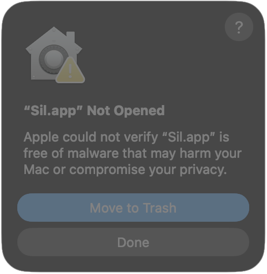

## Download the latest version of Sil-Q

The latest Sil-Q version is **v1.5.0**, released on 2022-01-03. Choose your
operating system and download from the table below.
[Read about the changes in this version](changes.md).

| Microsoft Windows         | Apple macOS (see note)      | Linux                       | Source code        |
| ------------------------- | --------------------------- | --------------------------- | ------------------ |
| [Sil-Q-windows-64.zip][w] | [Sil-Q-macos-native.zip][m] | [Sil-Q-linux-x86_64.zip][l] | [Sil-Q-src.zip][s] |

!!! warning "Important note for macOS users"

    Recent macOS versions may prevent you from launching Sil-Q. See the section
    below to solve this problem.

### How to launch Sil-Q on macOS

If you are on macOS 10.15 or later and haven't run Sil-Q before, the
[macOS Gatekeeper security feature](https://support.apple.com/en-us/102445) may
prevent you from starting the Sil-Q app as shown in the screenshot below.

{
width="300" }

Here is a step-by-step guide to launch Sil-Q on macOS when this happens:

1. Click the button "Done" in the macOS dialog window "Sil.app Not Opened" as
    shown above.
2. Then go to your Mac's `System Settings` > `Privacy & Security`, and scroll
    all the way down to the `Security` section. You will see an entry "Sil.app
    was blocked to protect your Mac". Here, click on the button "Open Anyway"
    and confirm that you do want to launch Sil-Q.
3. When Sil-Q launches now, you will see another macOS dialog window about
    granting Sil-Q access to your `Documents` folder. You must approve this
    access, because it is required by Sil-Q to store its savefiles for your
    in-game characters, the high score file, and additional game data in the
    folder `Documents/Sil/`.

## Download older Sil-Q versions

You can also
[download older releases](https://github.com/sil-quirk/sil-q/releases).

[l]: https://github.com/sil-quirk/sil-q/releases/LINUX-DOWNLOAD
[m]: https://github.com/sil-quirk/sil-q/releases/MACOS-DOWNLOAD
[s]: https://github.com/sil-quirk/sil-q/releases/SOURCES-DOWNLOAD
[w]: https://github.com/sil-quirk/sil-q/releases/WINDOWS-DOWNLOAD
