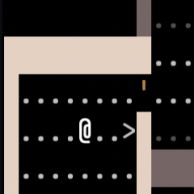
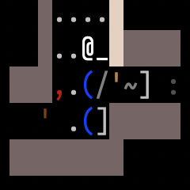
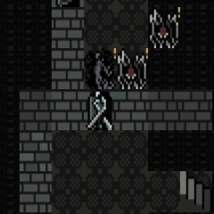

______________________________________________________________________

## title: Welcome to Sil-Q

**Sil-Q is a free, single-player dungeon infiltration game.**

You play an adventurer who must venture deep into the dungeons of Angband, the
fortress of the Dark Lord [Morgoth](https://tolkiengateway.net/wiki/Morgoth),
and attempt to steal a precious Silmaril from his iron crown and escape alive!

[**Download Sil-Q**](download.md){ .md-button .md-button--primary }
[Read Manual](manual.md){ .md-button }

- { width="168"
  }

  ______________________________________________________________________

  You, the `@`, start the game in the entrance of Angband. Descend into its
  depths using the down staircase `>` in your quest to steal a Silmaril from
  Morgoth.

- { width="168" }

  ______________________________________________________________________

  You explore randomly-generated dungeons, looking for loot and treasure: `]` is
  a set of gauntlets, `/` is a spear, `=` is a ring.

- { width="168" }

  ______________________________________________________________________

  You fight deadly monsters. `W` is an Oathwraith, `M` is a Spider of Gorgoroth.
  Be careful! If you die in battle, you must restart the game from the
  beginning.

- {
  width="168" }

  ______________________________________________________________________

  You can play the game with both classic ASCII art and tile-based graphics.
  Enjoy Oathwraiths, Spiders, and other foes in pixel glory.

