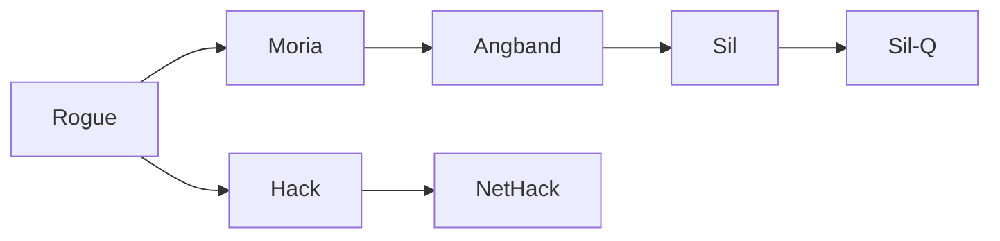

> ```
> A game of adventure set
>    in the First Age of Middle-earth,
>         when the world still rang with elven song
>             and gleamed with dwarven mail.
> Walk the dark halls of Angband.
>     Slay creatures black and fell.
>         Wrest a shining Silmaril from Morgoth's iron crown.
> ```

_Quote from the original Sil game (2012)._

## What is Sil-Q?

**Sil-Q is a free, single-player dungeon infiltration game.** It started
originally as [Sil (2012)](https://www.roguebasin.com/index.php/Sil) before its
first release as [Sil-Q (2018)](https://github.com/sil-quirk/sil-q). But the
lineage of its open source code traces back via
[Angband (1993)](<https://en.wikipedia.org/wiki/Angband_(video_game)>) and
[Moria (1983)](<https://en.wikipedia.org/wiki/Moria_(1983_video_game)>) all the
way to the original
[Rogue (1980)](<https://en.wikipedia.org/wiki/Rogue_(video_game)>), which was
the game that literally created the genre called "roguelikes".



Because Rogue was developed before computers had graphics, it had to use
letters, numbers, and symbols like `@` (player), `o` (orc) and `=` (ring) on the
screen to represent a dungeon filled with monsters and treasure. So rejoice,
dear reader, because by playing Sil-Q you will experience the First Age of
Middle-earth as well as the First Age of video game history! Compared to Rogue,
however, Sil-Q is a much more modern game. And yes, you can switch from
old-school letters and symbols to fancier tile-based graphics if you want.

```text
            #########
       ######..oo..?#
       ...  '...@...##
       #%###%..T...='
            #%'%#%%+##
             % %
         #####+######
```

_Figure: A typical dungeon room shown in Sil-Q's ASCII graphics._

In Sil-Q, your quest is to venture deep into the dungeons of Angband, the
fortress of the Dark Lord [Morgoth](https://tolkiengateway.net/wiki/Morgoth),
and attempt to steal a Silmaril from his iron crown and escape alive! The
[Silmarils](https://tolkiengateway.net/wiki/Silmarils) were precious gems
crafted by the high elf Fëanor, which captured the magical light of the Two
Trees of Valinor. They became the most prized treasure of Middle-earth and were
eventually stolen by Morgoth after he destroyed the Two Trees.

And we can't just let Morgoth get away with that, can we?

## Why play Sil-Q?

- **"How do you want to do this?" Win with strategies beyond killing monsters.**
  The game encourages you to out-wit the enemy. This is true to the canon, as
  Beren and Lúthien used stealth and cunning to escape with a Silmaril, not
  brute-force. The game has fleshed-out stealth and morale systems that let you
  win the game without attacking even a single monster! Of the four ways to
  strengthen your character by gaining experience, only one requires killing
  monsters.
- **Easy to learn, hard to get bored.** The rules of Sil-Q are simple. You can
  learn all the mechanics in your first few attempts of playing the game. The
  magic system, for example, consists of only twelve songs. Yet there is plenty
  of interaction between the skills & abilities, items, monsters, and the
  dungeon environment to keep you entertained for a long time.
- **Immersion, lore, and atmosphere**. It is one of very few games that stay
  true to the writings of Tolkien. There are no generic fantasy tropes like
  sorcerers or paladins, no spells of fireball or magical scrolls. Instead, it
  is the Norse saga–inspired world that Tolkien imagined, with warriors clad in
  shining mail, singing songs of rage and sorrow as they best their foes. The
  magic of the world is subtle, yet powerful.
- **Active community.** While the traditional roguelike genre is small, there is
  an active player base who enjoy dealing as `@` with `o`, `T`, and other
  bestiary. Head over to [Angband.live](https://angband.live/) to play online
  and spectate other players, or join the
  [Roguelikes Discord](https://discord.gg/9uVbTYH) to meet new friends and get
  help playing the game. There are dozens of us!
- **Sil-Q is free and open source software.** Always has been, always will be. A
  small but dedicated team of developers keeps the game fresh and alive.

Good luck, mellon, and have fun!

## Get Sil-Q

TODO: How to download and install.

## Start playing

TODO

- Summarize general flow of the game plus use of the UI.
- Next steps are to create a character and start playing.

## How to get help

TODO

- Read this manual.
- How to access the in-game help.
- Get help from the player community.

You can open the in-game help almost any time by pressing `?`. The help covers
the commands for movement, attacking, showing your inventory, and how to open
the game settings. It explains what symbols like `(` mean (when playing the game
in ASCII graphics mode), and more.

## Create a character

Each run in Sil-Q begins with the creation of your player character.

1. **Select the Race and the House of your character.**
    - _Once set, you cannot change the race and house during a run._
    - The order of the races is also the game difficulty setting: Noldor (high
      elves) are the easiest to play, Edain (humans) are the hardest.
    - Within each race, the Houses are considered as approximately equal in power
      level.
2. **Allocate 13 stat points between the four stats of Strength, Dexterity,
   Constitution, and Grace.**
    - _Once set, you effectively cannot change your stats until the very late
      game._ In particular, your character's maximum health (via Constitution) is
      set and fixed during character creation for most runs. And unlike in many
      other games, your health does not increase as you gain more experience
      points.
    - Beyond character creation, you will need to find rare items that give
      bonuses to these stats, or gain a huge amount of experience points to
      increase a stat by learning the most expensive ability in its ability tree.
    - Any left-over stat points are lost after character creation, so spend
      wisely and plenty!
3. **Spend up to 5,000 experience points to level up the eight skills of Melee,
   Archery, Evasion, Stealth, Perception, Will, Smithing, and Song.**
    - You can change these during a run. But you can only _increase_ skill
      levels—you can neither decrease nor reset them.
    - Your character will gain new experience points during a run, so your choice
      during character creation primarily influences the early game. Of course,
      as you get better at playing Sil-Q, you will want to match your starting
      choices with the kind of character you plan to play.
    - You keep any left-over experience points that you do not spend during
      character creation, so you can use them at any point later during a run.
      The flexibility of saving 500-1,000 unspent experience points for later use
      is a popular choice amongst veteran players, because it gives you better
      options to react to what happens during a run.

### Races

Choosing the race of your character is both a roleplay decision as well as the
way to set the difficulty of the game. Each race provides a few proficiencies
that pre-shape a character's playstyle. For example, the Noldor are proficient
with bows and thus a good choice if you enjoy attacking enemies from a distance.

- **Noldor (high elves)**
    - Difficulty: Medium
    - Recommended for beginners
    - Notable members in Tolkien lore: Fëanor, Galadriel

- **Sindar (grey elves)**
    - Difficulty: Hard
    - Notable members in Tolkien lore: Lúthien, Legolas

- **Naugrim (dwarves)**
    - Difficulty: Hard
    - Notable members in Tolkien lore: Durin, Gimli

- **Edain (humans)**
    - Difficulty: Very Hard
    - Notable members in Tolkien lore: Beren, Húrin

Choosing the race of your character (selected here: _Noldor_):

```text
Character Creation:

  a) Noldor [X]  Str +0
  b) Sindar      Dex +1
  c) Naugrim     Con +2
  d) Edain       Gra +2

                 bow proficiency
                 song affinity
```

### Houses

Choosing the house of your character (selected here: _House of Finarfin_):

```text
Character Creation:

  a) Noldor [X]  a) House of Feanor         Str +0
  b) Sindar      b) House of Fingolfin      Dex +1
  c) Naugrim     c) House of Finarfin  [X]  Con +2
  d) Edain                                  Gra +3

                                            bow proficiency
                                            perception affinity
                                            song affinity
```

### An Overview of Stats, Skills, and Abilities

Sil-Q has three main character progression systems: stats, skills, and
abilities.

Unlike other games, Sil-Q has neither traditional character levels ("I have a
level 5 character") nor classes ("My character is a Paladin"). Instead, you
shape and customize your character through its stats, skills, and abilities as
described below. Of course, you are welcome to roleplay your character so that,
for example, it feels like a Paladin!

- **Stats ("Base")**:
    - The four stats of _Strength_, _Dexterity_, _Constitution_, and _Grace_ are
      the **foundation** of your character. They determine your health and general
      proficiency in combat and magic.
    - Set at character creation. Further changes only in the very late game via
      the most expensive ability of each ability tree.
- **Skills ("Class")**:
    - The eight skills **focus** your character on a preferred playstyle, such as
      a melee fighter, stealthy assassin, or pacifist. Think of this as the
      _class_ of your character in other games.
    - Skills provide passive benefits only.
    - Skill levels are increased by spending _experience points_ (`Exp` in the
      UI). You start the game with 5,000 experience points, and you gain further
      experience by encountering monsters, killing monsters, descending deeper
      into the dungeons of Angband, and identifying unknown objects.
    - Leveling up a skill grants _skill points_, which are required for learning
      _abilities_ of that skill.
- **Abilities ("Talents")**:
    - Abilities are **specializations** of a skill, such as increasing the chance
      to critically hit in melee combat. Often called _talents_ in other games.
    - Some abilities are passive, some grant you a new active ability, such as a
      special attack or exchanging places with a monster.
    - Passive abilities can be switched off (and back on), which is occasionally
      useful.
    - Learned by spending _skill points_ (from leveling up an ability's parent
      skill) plus _experience points_.

### Stats (Strength, Dexterity, Consitution, Grace)

TODO:

- Don't over-explain. Put the example in the Appendix?
- Give recommendations for e.g. "melee fighter" (3-3-5-3), "ranged fighter"
  (2-4-4-3), "stealthy assassin" (2-4-3-5), "pacifist" (2-3-4-4). Or sth like
  that.

Your character has four main statistics: Strength (`Str`), Dexterity (`Dex`),
Consitution (`Con`), and Grace (`Gra`). The stats numbers can be positive or
negative, with zero representing the average for the Edain (humans) of this age.

- **Strength (`Str`)**:
    - _Improves combat damage and carrying capacity._
    - Increases the damage you do in combat. You can get an extra side on each
      damage die for each point of Strength. For example, a `2d5` curved sword
      becomes `2d7` when you have `Str 2`.
    - The damage increase is limited by the weapon weight (see the section _Combat
      Damage Calculation in Detail_).
    - Increases bow range, because it is based on the weapon damage.
    - Increases throw range by 20% per point of Strength.
    - Increases your carrying capacity by 20% per point of Strength.
    - Allows you to wield very heavy weapons without penalty.
    - Helps you resist being disarmed in combat.
    - Helps you break free of webs.
    - Helps you bash down locked doors.
- **Dexterity (`Dex`)**:
    - _Gives a bonus to the first four skills: Melee, Archery, Evasion, Stealth._
    - Helps you avoid needle traps in chests.
- **Constitution (`Con`)**:
    - _Increases your health points by 20% per point of Con._
    - Helps you stay alive, duh.
- **Grace (`Gra`)**:
    - _Gives a bonus to the last four skills: Perception, Will, Smithing, Song._
    - Increases your Voice points (like mana in other games) by 20% per point of
      Grace, which increases the time you can sing a song of power (like spells in
      other games).

Example: Starting values of a Noldor of House Finarfin.

```text
                                      Points Left: 13  <== 13 of 13 remaining

 Name   Miguno        Age                Str   0    0
 Race   Noldor        Height             Dex   1    0
 House  Finarfin      Weight             Con   2    0
                                         Gra   3    0

 Game Turn        0   Melee   (+1,1d1)   Melee        1 =  0  +1
 Exp Pool     5,000   Bows    (+1,0d0)   Archery      1 =  0  +1
 Total Exp    5,000   Armor   [+1,0-0]   Evasion      1 =  0  +1
 Burden         0.0                      Stealth      1 =  0  +1
 Max Burden   100.0   Health     28:28   Perception   4 =  0  +3      +1
                      Voice      34:34   Will         3 =  0  +3
                                         Smithing     3 =  0  +3
 Light Radius     0                      Song         4 =  0  +3      +1
```

Example: After spending 13 points on Str, Dex, Con, Gra stats.

```text
                                      Points Left:  0  <== 0 of 13 remaining

 Name   Miguno        Age                Str   3    6  <== 6 points spent (Str 0→3)
 Race   Noldor        Height             Dex   3    3  <== 3 points spent (Dex 1→3)
 House  Finarfin      Weight             Con   4    3  <== 3 points spent (Con 2→4)
                                         Gra   4    1  <== 1 points spent (Gra 3→4)

 Game Turn        0   Melee   (+3,1d4)   Melee        3 =  0  +3
 Exp Pool     5,000   Bows    (+3,0d0)   Archery      3 =  0  +3
 Total Exp    5,000   Armor   [+3,0-0]   Evasion      3 =  0  +3
 Burden         0.0                      Stealth      3 =  0  +3
 Max Burden   172.8   Health     41:41   Perception   5 =  0  +4      +1
                      Voice      41:41   Will         4 =  0  +4
                                         Smithing     4 =  0  +4
 Light Radius     0                      Song         5 =  0  +4      +1
```

Strength 0→3:

- Improved Melee from `(+1,1d1)` to `(+1,1d4)`.
- Improved Max Burden from `100.0lb` lb to `172.8lb`.

Dex 1→3:

- Improved Melee from `(+1,1d4)` to `(+3,1d4)`.
- Improved Bows from `(+1,0d0)` to `(+3,0d0)`.
- Improved Armor from `[+1,0-0]` to `[+3,0-0]`.

Con 2→4:

- Improved Health from `28:28` to `41:41`.

Gra 3→4:

- Improved Voice from `34:34` to `41:41`.

### Skills (Melee, Archery, Evasion, Stealth, Perception, Will, Smithing, Song)

TODO:

- Melee: melee attack chance to hit
- Archery: ranged attack chance to hit
- Evasion: chance to evade attacks
- Stealth: avoid detection by enemies
- Perception: detect hidden enemies
- Will: mental resistance against XXX
- Smithing: craft items
- Song: song power (spellcasting)
- Explain that increasing the level of a skill grants skill points for learning
  abilities of that skill.

Spending experience points on skills:

```text
 Name   Miguno        Age                Str   3
 Race   Noldor        Height             Dex   3
 House  Finarfin      Weight             Con   4
                                         Gra   4             Points Left:  200  <==

 Game Turn        0   Melee   (+9,1d4)   Melee        9 =  6  +3          2100  <==
 Exp Pool       200   Bows    (+3,0d0)   Archery      3 =  0  +3             0
 Total Exp    5,000   Armor   [+9,0-0]   Evasion      9 =  6  +3          2100  <==
 Burden         0.0                      Stealth      3 =  0  +3             0
 Max Burden   172.8   Health     41:41   Perception   5 =  0  +4      +1     0
                      Voice      41:41   Will         4 =  0  +4             0
                                         Smithing     4 =  0  +4             0
 Light Radius     0                      Song         8 =  3  +4      +1   600  <==
```

- Improved Melee from `(+3,1d4)` to `(+9,1d4)`.
- Improved Armor from `[+3,0-0]` to `[+9,0-0]`.

### Abilities

TODO:

- Explain how to gain skill points to pay for abilities.
- You can toggle (passive) abilities off/on.

An overview of abilities:

- **Melee**:
    - Power
    - Finesse
    - Knock Back
    - Polearm Mastery
    - Charge
    - Follow-Through
    - Impale
    - Subtlety
    - Whirlwind Attack
    - Zone of Control
    - Smite
    - Two Weapon Fighting
    - Rapid Attack
    - Strength (+1 stat)
- **Archery**:
    - Rout
    - Fletchery
    - Point Blank Archery
    - Puncture
    - Ambush
    - Versatility
    - Crippling Shot
    - Deadly Hail
    - Dexterity (+1 stat)
- **Evasion**:
    - Dodging
    - Blocking
    - Parry
    - Crowd Fighting
    - Leaping
    - Sprinting
    - Flanking
    - Heavy Armour Use
    - Riposte
    - Controlled Retreat
    - Dexterity (+1 stat)
- **Stealth**:
    - Disguise
    - Assassination
    - Cruel Blow
    - Exchange Places
    - Opportunist
    - Vanish
    - Dexterity (+1 stat)
- **Perception**:
    - Quick Study
    - Focused Attack
    - Keen Senses
    - Concentration
    - Alchemy
    - Bane
    - Outwit
    - Listen
    - Master Hunter
    - Grace (+1 stat)
- **Will**:
    - Curse Breaking
    - Channeling
    - Strength in Adversity
    - Formidable
    - Inner Light
    - Indomitable
    - Oath
    - Poison Resistance
    - Vengeance
    - Majesty
    - Constitution (+1 stat)
- **Smithing**:
    - Weaponsmith
    - Armoursmith
    - Jeweller
    - Enchantment
    - Expertise
    - Artifice
    - Masterpiece
    - Grace (+1 stat)
- **Song**:
    - Song of Elbereth
    - Song of Challenge
    - Song of Delvings
    - Song of Freedom
    - Song of Silence
    - Song of Staunching
    - Song of Thresholds
    - Song of the Trees
    - Song of Slaying
    - Song of Staying
    - Song of Lorien
    - Song of Mastery
    - Woven Themes
    - Grace (+1 stat)

Misc:

- Song of the Trees: reveals hidden enemies like Nightthorns, which create
  darkness around them.

Spending skill points and experience points on abilities (selected here:
_Finesse_ of the _Melee_ tree):

```text
 Skills         Abilities

  a) Melee [X]   a) Power                 Lowers the base number needed to get
  b) Archery     b) Finesse [X]           critical hits with melee from 7 to
  c) Evasion     c) Knock Back            5.
  d) Stealth     d) Polearm Mastery
  e) Perception  e) Charge
  f) Will        f) Follow-Through
  g) Smithing    g) Impale                Prerequisites:
  h) Song        h) Subtlety
                 i) Whirlwind Attack        2 skill points (you have 6)
                 j) Zone of Control
                 k) Smite
                 l) Two Weapon Fighting
                 m) Rapid Attack          Current price:
                 n) Strength
                                            500 experience (you have 200)
```

## Improve your character

TODO:

- Explain how to level up: skills, abilities

## User Interface

### Main Window

```text
Miguno         <== name of your character

Str        3   <== Strength score     \
Dex        4   <== Dexterity score     \  character
Con        4   <== Constitution score  /    stats
Gra        3   <== Grace score        /

Exp    2,163   <== experience points available to spend on skills and abilities

Health 36:41   <== currentHealth:maxHealth
Voice  25:34   <== currentVoice:maxVoice (mana for singing songs)

     (9,2d8)   <== attack: Melee score (left), weapon damage dice (right)
     (7,2d4)   <== attack: Archery score (left), weapon damage dice (right)
  [+10,4-13]   <== defense: Evasion score (left), protection dice (right)

  *****___     <== monster health (only shown in combat or when "looking")
 Confident 3   <== monster morale (only shown in combat or when "looking")
```

## Combat

### Combat Overview

Combat between an attacker and a defender has two steps:

1. **Does the attack hit? (hit score)** The attacker and the defender roll dice
   to determine whether the attack hits.
2. **How much damage is dealt by the attack? (damage score)** If the attack does
   successfully hit, the attacker and the defender roll dice to determine the
   damage dealt to the defender.

The player and the monsters use the same logic for combat. So, for example, if
you understand how you can deal damage to a monster, you also understand how
monsters deal damage to you.

### Combat step 1: Does the attack hit? (hit score)

To determine whether an attack hits, the attacker makes an **attack roll** and
the defender makes an **evasion roll**.

- **Hit score** = **attack roll** minus **evasion roll**. An attack is
  successful if its hit score is `>0`, i.e., if the attack roll is greater than
  the evasion roll. If the hit score is sufficiently large, the attacker scores
  a **critical hit**, which deals bonus damage (described later).

For melee attacks:

- **Attack roll**: `1d20` + attacker's Melee score (see below)
- **Evasion roll**: `1d20` + defender's Evasion score (see below)

For ranged attacks:

- **Attack roll**: `1d20` + attacker's Archery score (see below) + the attack
  bonus of the arrow being fired + a range penalty of `-1` for every 5 squares
  of distance to the target
- **Evasion roll**: `1d20` + only 50% of the defender's Evasion score (see
  below). Evasion is significantly less useful against ranged attacks.

For throwing weapons:

- **Attack roll**: `1d20` + attacker's Melee score + a penalty of `-5` if the
  weapon/item is not designed to be thrown + a range penalty of `-1` for every 5
  squares of distance to the target
- **Evasion roll**: `1d20` + defender's Evasion score [TODO: verify this]

Here's an overview of how the game calculates an attacker's Melee/Archery scores
and an defender's Evasion score.

- **Melee and Archery scores (attacker)**
    - **Melee score** = Melee skill level plus any modifiers from items,
      consumables, status effects (such as `Stunned`), and enemy positions. The
      game shows a base Melee score in the main window (e.g., the `9` in `(9,2d8)`
      in the example main window above), but this score does not take status
      effects, enemy positions, etc. into account.
    - **Archery score** = Archery skill level plus any modifiers from items,
      consumables, status effects (such as `Stunned`), and enemy positions. The
      game shows a base Archery score in the main window (e.g., the `7` in
      `(7,2d4)` in the example main window above), but this score does not take
      status effects, enemy positions, etc. into account.
    - **Bonus for surrounding the defender**. Because the (single) player can
      never surround a monster from multiple directions, only the monsters receive
      this bonus. The more attackers are near the defender, the higher the bonus.
      For the player, this means even weak monsters can become deadly when they
      surround and overwhelm you!
    - **Penalty for lack of vision**: Melee and Archery score are reduced by 50%
      if the attacker cannot see the defender (e.g., because the attacker is
      `Blind` or there is a lack of light).
- **Evasion score (defender)**
    - **Evasion score** = Evasion skill level plus any modifiers from items,
      consumables, status effects (such as `Stunned`), and enemy positions.
    - **Penalty for lack of vision**: Evasion score is reduced by 50% if the
      defender cannot see the attacker (e.g., because the defender is unwary).
    - **Penalty for reduced mobility**: Evasion score is reduced by 50% if the
      defender fights from within a pit or web.
    - **Penalty for letting your guard down (for Archery attacks)**: If the
      defender uses a ranged attack while attackers are in melee range, then these
      attackers gain a free opportunity attack at a 50% reduced Evasion score of
      the defender.
    - **Penalty for helplessness**: If the defender is asleep, entranced, or
      unable to move, the Evasion score becomes negative (the most severe
      penalty), irrespective of any other modifiers.

Misc:

- TIP: See the Appendix for a walk-through of how an attack plays out, and how
  it looks like in the Combat Rolls window.

**Critical hits:** If the attack roll is much greater than the evasion roll
(i.e., if the hit score is very large), then the attack scores a _critical hit_.
Critical hits grant bonus damage by adding one or more _bonus rolls_ of the
weapon's damage base die when calculating the hit's damage in the second combat
step. For example, a `1d5` damage die can multiply into a `2d5`, a `3d5`, or
even better because of a critical hit.

To increase your chance to score critical hits and, when you do make a critical
hit, their associated bonus damage:

- Use lighter weapons. Lighter weapons have a higher crit chance because of
  their easier handling. A dagger can more easily strike into the gap in the
  enemy's armor than a battle axe!

- Certain abilities increase the crit chance, such as the Melee abilities
  _Finesse_ and _Subtlety_.

- Find ways to increase your hit score. The hit score is the difference between
  the attacker's attack roll and the defender's evasion roll, so anything that
  raises your attack roll (e.g., learning the Stealth ability _Assassination_,
  raising your Melee skill level) or that lowers the enemy's evasion roll (e.g.,
  stunning monsters by blowing a horn, putting them to sleep with _Song of
  Lorien_) helps scoring critical hits.

- TIP: See the Appendix for details on critical hit calculation including bonus
  damage, and what weapon properties and character abilities influence the
  chance to critically hit.

### Combat step 2: How much damage is dealt by the hit? (damage score)

To determine how much damage is dealt when an attack does successfully hit, the
attacker makes a **damage roll** and the defender makes a **protection roll**.
If the damage roll is greater than the protection roll, then the attack deals
the roll difference as damage. Otherwise, no damage is dealt.

- **Damage roll (attacker)**: Uses the attacker's weapon damage dice. Primarily
  determined by the stats of the attacker's weapon plus any modifiers from other
  items, consumables, songs, etc.
- **Protection roll (defender)**: Uses the defender's protection dice. Primarily
  determined by the pieces of armor worn by the defender plus any modifiers from
  other items, consumables, songs, etc.
- **Damage score** = **damage roll** minus **protection roll**. Damage is dealt
  equal to the score's value, but only if the score is `>0`.

Misc:

- TIP: See the Appendix for a walk-through of how an attack plays out, and how
  it looks like in the Combat Rolls window.

- TIP: If you care about the details of damage calculation, take a look at the
  Appendix. However, most players find it sufficient to learn and play by feel.

Be aware that the main window in the game may show inaccurate information for
your weapon damage dice. In combat, _the actual damage dice can be different_.

```text
Miguno

Str        3
Dex        4
Con        4
Gra        3

Exp    2,163

Health 41:41
Voice  34:34

     (9,2d8)  <== 2d8 are the weapon damage dice for melee attacks
     (7,2d4)  <== 2d4 are the weapon damage dice for bow attacks
  [+10,4-13]
```

For example, a `2d8` can become a `3d8` when you score a critical hit. But a
critical hit may or may not happen, and the main window does not take such
possibilities into account. The source of truth is the Combat Rolls window (you
can enable it via the menu), which will always show you the complete and correct
information during combat.

TODO: Explain how to show/hide the combat window, depending on what binary you
use.

### Elemental Damage

TODO: This section is abound "brands" aka enchantments. See my offline notes.

- Weapons with cold/fire/... damage: The example was Aeglos, the spear of
  Gil-galad. "It is branded with frost." Monsters that have no frost/cold
  resistance suffer from 1 extra damage die (e.g., 1d11 becomes 2d11 for
  non-frost resistant monsters).

## Monsters

- "Raukar" is the name used in Sil-Q for demons like Balrogs. (I found a slay
  sword that provided bonus dmg vs. dragons and raukar.)

## Items

### Weapons

TODO

### Armor

- Heavier armor with `[-N]` evasion modifier lowers evasion score, which means
  that monsters are more likely to hit you AND they are more likely to critical
  hit you.

### Jewellry (rings, amulets)

TODO

### Consumables (herbs, potions, scrolls, staves)

TODO

- Herbs are food. If your character is hungry, you can eat herbs as nourishment.

### Horns

TODO

Horns are instruments.

### Special Items `{special}`

TODO

Items that are marked `{special}` bear some unknown enchantment. You will have
to discover what these enchantments are, for example by using the item.

- "Slaying" enchantments make weapons glow brightly (larger light radius) when
  you are near the monster type against which they provide a damage bonus
  (similar to the sword Sting in The Hobbit). The bonus is an additional damage
  die against these monsters. For example, a Shortsword of Gondolin
  `(+0,1d7) [+1]` bears an enchantment against orcs. This means that this sword
  does an extra die of damage against orcs, improving its `1d7` to `2d7` versus
  orcs.
- "Stealth" enchantments improve your stealth. For example, a Dagger of Murder
  `(+0, 1d5) <+2>` improves your stealth by 2.

### Identify items

TODO

- Learn the "ID sub-game". Some options are always the same, for example. Enjoy
  the free XP!
- Most common potion is Antidote. To identify it, get poisoned by a harmless
  enemy like a venomous spider to then test-quaff the potion.
- Murky brown potions are ALWAYS potions of orcish liquor. They heal you a bit
  (1/4 of health?), but they also stun you. Quaff them when no enemies are
  nearby.
- Tactic for staff/staves: Use (u) the unidentified staff in a room with 1. a
  monster in your line of sight, 2. an open door, and 3. stairs. Reason is that
  these three are things that staves can affect. e.g., a staff of imprisonment
  closes doors.
- Abilities like Alchemy.
- Example: To identify an armor with resistance to cold, you can try to get hit
  by a monster with cold attacks.
- You must be able to observe the hidden, yet unidentified effect of the item.
  For example, there are a few potions that you might not identify on first
  quaff, such as antidote (you must be poisoned to see its effect).

### Craft items via Smithing

TODO

- You can create, enchant, modify, and melt items by smithing at a forge. For
  example, you can create a Ring of Frost that provides fire resistance.
- You have to find a forge (symbol `0`) and, when standing in it, press `,` to
  smith.
- To confirm: Each forge can only be used once, so your choice matters.

### Inscribe items

- Q: What does inscribe or auto-inscribe do? See my offline notes.

## Stealth

TODO

## Morale

TODO

## Skills

TODO

## Abilities

### Songs

- Song of Challenge: Melee monsters may come to you, but ranged monsters may
  still run away but at least they stop shooting at you.
- Staff of Summing: must be used near stairs to summon the monsters it can
  summon (makes monsters come up or down stairs)

## Dungeon

- You can go up and down the stairs.
- At some point (cf. min depth), you can no longer take up stairs. This is a
  mechanic that forces you to dive deeper into the dungeons.
- When you go up or down the stairs, the level you enter will be newly
  generated. You can't go back to a previous level. That's a traditional
  behavior of Angband variants, including Sil-Q. The lore answer is that you can
  think of Angband as such a large labyrinth that it is impossible to navigate
  its dungeons.

## Game settings

TODO

- How to switch between tiles and ASCII.
- How to change fonts, how to increase font size.
- Lots more.

## Tips and Tricks

### Good habits for beginners

These are rules of thumb aimed at beginners who are just getting started.

- **Focus on raising the skill levels of Melee and Evasion in the early game.**
  Most beginners benefit from spending their experience points during the first
  dungeon levels on raising these skills, rather than spending experience on
  many abilities. It is common to raise skills to a `(+10)` Melee score and
  `[+10]` Evasion score (and higher) before starting to invest more into
  abilities. Think of skills as the widely-beneficial fundamentals of your
  character, and of abilities as specializations with narrower benefits. There
  are exceptions, but you will quickly learn those the more you <s>die</s> play.
- **Don't commit too early on weapon-specific abilities.** Try developing a
  sense for the right time at which you can commit to certain weapon types for
  the remainder of your dungeon run. It's a bad feeling when you invested a lot
  of experience points in the early game on into abilities that improve the use
  of swords, only to find a special greatspear with strong modifiers in the next
  dungeon level.
- **Avoiding fights is a smart idea.** In Sil-Q, there are many strategies to
  win the game. Many of them do not focus on fighting, some even never fight at
  all! Learn how to use stealth and the morale system to your advantage. Learn
  when it is better to avoid a fight or, when spotted, to run away from a fight.
  Experiment with non-combat strategies— you will find them both effective and
  entertaining.
- **Have a reserve of experience points available as a safety precaution.** In
  Sil-Q, you don't know ahead of time what monsters or combat situations you
  will run into. A reserve of experience points is useful because it lets you
  adapt to the situation at hand. Is your evasion score too low for the unique
  monster you are facing? Then spend some of your reserve experience points to
  level up your Evasion skill or learn a new ability such as _Dodging_. And if
  your defense isn't the problem, but the monster is too hard to hit? Then level
  up your Melee skill. You get the idea.
- **Don't grind.** The experience mechanics in Sil-Q do not reward grinding. You
  gain less and less experience for encountering or killing the same monsters
  over and over (another reason why you should learn to avoid fights). Likewise,
  you don't need to explore everything. If you aren't certain there's still
  useful loot to find on the current dungeon level, and you believe you can
  survive a level deeper, take the stairs down. Unless you enjoy the grind, of
  course.

### How can I increase my chance to hit a monster?

1. Increase the level of your Melee skill (if you prefer melee attacks) or the
   Archery skill (if you prefer ranged attacks) via the character sheet,
   accessed by pressing `@` (i.e., `Shift+2` on US ASCII keyboards) and then
   `i`. Leveling up the Melee/Archery skill is especially important in the early
   game.
2. Use items that give a bonus to your Melee or Archery score, such as a weapon
   with `(+1, ...)`. Unfortunately, many weapons have a negative attack bonus,
   so you must learn the trade-offs between the various weapons. For example, do
   you prefer weapons that have a higher chance of hitting, but that deal lower
   damage? Or weapons that have a lower chance of hitting, but when they hit
   they deal higher damage?
3. Learn _abilities_ that give an attack bonus, such as the Melee ability
   _Polearm Mastery_, accessed by pressing `TAB`.

- TODO: Does Polearm Mastery increase the chance to hit or does it add bonus
  sides to the damage roll? This requires multiple updates throughout the
  document.

### How can I prevent monsters from hitting me?

> NOTE: Ask yourself first whether the potential reward of fighting is worth the
> risk of dying. **Often, the best choice is to not fight at all.** Sil-Q has a
> fleshed-out stealth system, so use it to your advantage. And yes, you can
> actually win the game without attacking a single monster—search online for
> "pacifist" builds!

Here are some guidelines on hit prevention:

1. If you can _evade_ an attack, you always take zero damage. Increase the level
   of your Evasion skill via the character sheet, accessed by pressing `@`
   (i.e., `Shift+2` on US ASCII keyboards) and then `i`. Leveling up the Evasion
   skill is especially important in the early game.
2. Use items that provide a bonus to your Evasion score, such as armor with
   `[+4, …​]`. That said, many items such as heavy armor have a negative evasion
   bonus, so you must learn the trade-offs between the various item choices as
   you get better at the game. For example, do you prefer light armor to evade
   better, but take more damage when attacks do hit? Or heavy armor that makes
   evasion harder, but you will take less damage when attacks hit?
3. Learn abilities that give an evasion bonus, such as the Evasion abilities
   _Dodging_ and _Parry_, accessed by pressing `TAB`.
4. If you fail to evade an attack, your next and final chance is to mitigate any
   incoming damage with good protection rolls. The higher your protection die
   (the `3-11` in `[+4,3-11]`, think of it as a `1d9 + 2`), the higher your
   protection rolls. Your protection die is primarily determined by the pieces
   of armor you wear, plus any modifiers from other items, consumables, etc.
5. Don't fight, sneak! Prevent monsters from noticing you by using stealth and
   smart positioning/movement to sneak past them. Learn abilities such as the
   Stealth ability _Disguise_ to hide better or the Perception ability _Keen
   Senses_ to spot monsters before they can spot you.
6. Don't fight, run away! This is also often your last option when you are
   forced to fight (e.g., you tried to sneak but failed). Learn abilities such
   as the Evasion abilities _Dodging_ and _Sprinting_ to retreat from fights
   more safely. Become better at positioning before and during the battle to
   make your escapes easier to pull off.

## Credits

TODO

## Appendix

### Sil-Q compared to original Sil

TODO

See Sil-Q 1.5.0 manual.

### Sil-Q compared to Angband

TODO

See Sil-Q 1.5.0 manual.


### An attack in more detail (with Combat Rolls window)

Let's walk through an example of a melee attack, given the following attacker
and defender.

```text
            Attacker      Defender
         ===========      ========

         Melee score
              |
              v
Melee       (+9,2d8)      (+2,1d5)
Archery     (+3,1d7)
Defense   [+10,4-13]        [+3,0]
                              ^
                              |
                         Evasion score
```

- The attacker's Melee score is `(+9)`, so the attack roll will use `1d20 + 9`.
- The defender's Evasion score is `[+3]`, so the evasion roll will use
  `1d20 + 3`.

Given this setup, an attack would look in the game's Combat Rolls window as
follows.

Example: Successful attack (player `@` hits orc `o`).

```text
      Step 1: Hit?                Step 2: Damage?
=========================    =========================

@ (+9)  23  12  11 [+3] o -> (3d8)   6   5   1   [1d4]
```

- Combat step 1: Does the attack hit?
    - The attack roll of the player was a `1d20` for 14 plus `(+9)` for a total of
      **23**.
    - The evasion roll of the orc was a `1d20` for 8 plus `[+3]` for a total of
      **11**.
    - This attack successfully hits the orc, because the **hit score** of 23 - 11
      = **12** is greater than zero.
- Combat step 2: How much damage is dealt by the hit?
    - The damage roll of the player was a `3d8` for a total of **6**.
    - The protection roll of the orc was a `1d4` for a total of **1**.
    - The **damage score** is 6 - 1 = **5**, so 5 points of damage are dealt to
      the orc.

Example: Failed attack (player `@` misses orc `o`).

```text
@ (+9)  10  -  14 [+3] o
```

- Combat step 1: Does the attack hit?
    - The attack roll of the player was a `1d20` for 1 plus `(+9)` for a total of
      **10**.
    - The evasion roll of the orc was a `1d20` for 11 plus `[+3]` for a total of
      **14**.
    - This attack fails to hit the orc, because the **hit score** of 10 - 14 =
      **-4** is not greater than zero. When an attack fails, the hit score is
      shown as `-`.
- Combat step 2: How much damage is dealt by the hit?
    - Because the attack failed to hit, no damage is dealt.

### Combat Damage Calculation in Detail

To determine how much damage is dealt when an attack does successfully hit, the
attacker makes a _damage roll_. This roll uses the attacker's weapon damage
dice. Unfortunately, the weapon damage dice information shown in main window in
Sil-Q can be misleading. This section explains the details of damage
calculation, so that you can assess a combat situation _before_ the combat
starts, thus increasing your chance of survival.

The actual weapon damage dice are a combination of the following parameters. The
logic is the same for the player and the monsters. As you can see, the damage
dice may change due to a variety of factors.

1. **Base damage die of the weapon** (e.g., `2d5`) as shown by the weapon stats.
    - Penalty for throwing weapons not meant for throwing. Only some items are
      meant to be thrown as weapons, such as daggers, throwing axes, and spears.
      For most other items, however, the number of damage sides is reduced by 50%
      because they were not designed for throwing. For example, a longsword deals
      less damage when it is thrown than when it is used as a melee weapon.
2. **Any bonus _rolls_ of the base die** (e.g., changing `2d5` to `4d5`) because
   of the modifiers below.
    - Critical hit bonus rolls (see the next section). Be aware that some
      monsters are resistant to critical hits (which reduces the bonus rolls by
      50%; examples are wights, wraiths, shadows, raukar/balrogs) or even fully
      immune (no bonus rolls; examples are molds and thorns).
    - Bonus rolls from enchantments such as "slaying". For example, a sword of
      orc-slaying grants 1 bonus roll against orcs.
    - Bonus rolls from elemental damage. Some special weapons deal elemental
      damage. For example, the fire brand property grants 1 bonus roll against
      enemies that do not resist this element, and 2 bonus rolls against enemies
      that are explicitly vulnerable to it (e.g., when dealing fire damage to a
      frost demon).
3. **Any bonus _sides_ of the base die** (e.g., changing `2d5` to `2d8`) because
   of the modifiers below.
    - Strength bonus. The greater your Strength and the weapon weight, the more
      bonus sides. This bonus benefits from heavier weapons, because it is
      limited to +1 bonus side per 1.0lb of weapon weight (fractional values such
      as `.5lb` are ignored). For example, you cannot gain more than +4 bonus
      sides with a 4.0lb battle axe, and you cannot gain any bonus sides with a
      0.5lb dagger. Note that negative Strength will subtract damage sides in the
      same way!
    - Ability bonus. Abilities such as the Melee abilities _Power_ (+1 bonus side
      with all melee weapons) and _Polearm Mastery_ (+2 bonus sides with spears
      and glaives).
    - Bonus for wielding a weapon "properly". Some weapons like bastard swords
      are _hand-and-a-half_ weapons that can be used one-handed or two-handed
      (the latter is referred to as wielding it properly). If you are not wearing
      a shield, you are presumed to be wielding such weapons with two hands, and
      as a result such weapons gain bonus sides (e.g., a bastard sword changes
      from `3d4` to `3d6`).

Some rules of thumb:

- Weapons that roll many dice such as axes and bastard swords benefit a lot from
  Strength, because this adds bonus _sides_ (e.g., `3d4` changes to `3d8`).
  Consider learning abilities such as _Power_ that add bonus sides when using
  such weapons.
- Weapons that roll few, but large dice such as spears and polearms benefit a
  lot from critical hits and the "slaying" property, because this adds bonus
  _rolls_ (e.g., `1d9` changes to `3d9`). Consider learning abilities such as
  _Finesse_ that increases the critical hit chance when using such weapons.

### Critical Hit Calculation in Detail

A critical hit is scored when **bonusRolls** `>= 1` in the following simplified
formula:

```text
                              hitScore
bonusRolls = FLOOR( -------------------------------- )
                    weaponWeight + critBaseThreshold
```

where:

1. **hitScore** (higher is better): The difference between the attacker's attack
   roll and the defender's evasion roll (see combat step 1).
2. **weaponWeight** (lower is better): The _weight_ of the attacker's weapon.
3. **critBaseThreshold** (lower is better): The _base threshold_ for critical
   hits, which has a default value of 7. Abilities such as _Finesse_ can modify
   this value.
4. **FLOOR()** is the math function "floor" that rounds any real number down to
   the greatest integer that is less than or equal to it. For example, both
   `FLOOR(3.1)` and `FLOOR(3.9)` have the result `3`.

> The full formula is more complicated. For example, some monsters are resistant
> to critical hits (which reduces the bonus rolls by 50%) or even fully immune
> (no bonus rolls). If you really want to know all the gory details, explore the
> function `crit_bonus()` of
> [cmd1.c](https://github.com/sil-quirk/sil-q/blob/master/src/cmd1.c) in the
> Sil-Q source code. The relevant variable is `crit_bonus_dice`. Different to
> the formula we discussed in this section, the `weight` parameter in the source
> code is `5` for a `0.5lb` weapon and `70` for a `7.0lb` weapon, for example.
> Lastly, the code documentation at the top of `crit_bonus()` includes some
> damage tables as comments. As of January 2026 (commit `3374757`), the values
> of the current damage table are not always correct.
>
> Further files of interest are
> [monster.txt](https://github.com/sil-quirk/sil-q/blob/master/lib/edit/monster.txt)
> (`RF1_RES_CRIT` and `RF1_NO_CRIT` from `crit_bonus()` refer to the monster
> flags `RES_CRIT` and `NO_CRIT`, respectively) and
> [object.txt](https://github.com/sil-quirk/sil-q/blob/master/lib/edit/object.txt)
> (defines weapons including their weights).

Example: Calculating critical hits for a Dagger (before abilities like Finesse),
assuming the **hitScore** of an attack in combat step 1 was `8`:

```text
Dagger (0, 1d5) 0.5lb

==> hitScore          = 8
==> weaponWeight      = 0.5 (from 0.5lb)
==> critBaseThreshold = 7   (default value before abilities, modifiers)

                       8
bonusRolls = FLOOR( ------- ) = FLOOR(1.0667) = 1
                    0.5 + 7
```

In this example, a critical hit was scored that grants 1 bonus roll of the
weapon damage dice. The damage roll for this particular attack will therefore
use a `2d5` instead of the dagger's default of `1d5`.

The behavior of the formula results in _ranges of hit scores_ that will result
in 0, 1, 2, or more bonus rolls, respectively. In the dagger example below, for
instance, any hit score between 8 (including) and 14 (including) will result in
1 bonus roll.

Example: Hit score ranges for critical hits with a Dagger (before abilities like
Finesse):

```text
Dagger (0, 1d5) 0.5lb

hitScore   bonusRolls    weaponDmgDice
---

---

     1-7   0          => 1d5 (base damage, no crit)
    8-14   1          => 2d5 (crit)

15-22 2 => 3d5 (double crit)
23-29 3 => 4d5 (triple crit)
...

```

Example: Hit score ranges for critical hits with a Greatsword (before abilities
like Finesse):

```text
Greatsword (-2, 3d6) 6.0lb

hitScore   bonusRolls    weaponDmgDice
---------------------------------------------------
    1-12   0          => 3d6 (base damage, no crit)
   13-25   1          => 4d6 (crit)
   26-38   2          => 5d6 (double crit)
   39-51   3          => 6d6 (triple crit)
     ...
```

The light dagger has a much higher chance to critically hit an enemy than the
heavy greatsword. The dagger requires a hit score of only 8 to gain 1 bonus
roll, whereas the greatsword requires at least 13. The greatsword is not only
heavier than the dagger, it also has a lower chance to make a successful hit in
the first place, because it has a negative attack bonus of `(-2)`.

Let's illustrate this significant difference in crit chance between a dagger and
a greatsword: to close the gap from a hit score of 8 (dagger) to 13 (greatsword)
to gain 1 bonus roll, you need an expensive investment of 5 (!) additional skill
points in Melee, for example, when you are wielding a greatsword. This is a very
expensive investment that would require your character to complete several
dungeon levels for gaining the necessary experience points---a dangerous task.
And this is only to gain 1 bonus roll. The gap for 2 bonus rolls is even larger:
you must go from 15 (dagger) to 26 (greatsword), a gap of 11!

What have we learned from this? If you want to increase your crit chance, you
should:

- Use lighter weapons rather than heavier weapons, because they reduce the
  **weaponWeight** parameter in the formula.
- Learn abilities that reduce the **critBaseThreshold**, such as the Melee
  abilities _Finesse_ (reduces the threshold by 2) or _Subtlety_ (reduces the
  threshold by 2 when using a one-handed weapon with the other hand free). It's
  as if the weapon became 2.0lb lighter without losing any Strength bonus for
  its actual weight.

### Misc TODOS

- "ASCII is the book, and graphical tiles are the movie."
